# Headscale China Kit

Build a private mesh VPN that connects a user's own devices across the Great
Firewall: devices inside China reach a "home base" machine abroad reliably,
with an optional full-tunnel exit. It uses a **self-hosted Headscale** control
plane plus a **built-in DERP relay** on an overseas VPS, fronted by the user's
**own domain over HTTPS/443**. Clients stay stock Tailscale.

## Core principle

**Assume the VPS (control plane) can be compromised, and design so an attacker
who owns it still cannot log into the user's devices or hijack their traffic.**
Every decision below serves this. The VPS is a dumb relay that holds no key
capable of logging into any user device.

## When to use

- Official Tailscale fails from China: `login.tailscale.com` / `controlplane.tailscale.com` are DNS-polluted and SNI-blocked; no official DERP node in mainland China → relayed traffic detours abroad at 1000ms+.
- User wants their phone/laptop in China to SSH / reach services / full-tunnel back to a machine abroad.
- User wants a self-hosted, on-demand, hard-to-block alternative to a commercial VPN, under their own domain.

**Not for:** circumventing the law, mass/commercial proxy services, or any
deployment the user is not authorized to run. This kit connects a user's *own*
devices. Make the user confirm that scope.

## How to use this skill

This is an **interview-first deployment** skill. Do NOT ask the user to pick a
solution — the solution is in this kit. Ask only about their devices,
preferences, and constraints, then recommend and execute.

```dot
digraph flow {
  rankdir=LR;
  interview -> recommend -> provision -> install -> enroll -> harden -> verify -> optional;
  interview [label="0. Interview\n(needs/constraints)"];
  recommend [label="1. Recommend\narchitecture"];
  provision [label="2. VPS + domain"];
  install   [label="3. Install\nHeadscale"];
  enroll    [label="4. Enroll +\ntag devices"];
  harden    [label="5. Harden\n(sshd, ACL, DNS)"];
  verify    [label="6. Red-team\nverify"];
  optional  [label="7. Exit nodes /\nlifecycle"];
}
```



### Step 0 — Interview (ask, then stop asking)

Gather these. Prefer one topic at a time; skip anything already answered.

1. **Devices & roles.** Which machine abroad should be reachable (the *home base*)? Which devices travel into / live in China (laptops, phones)? OS of each (Linux, WSL2, macOS, Windows, iOS, Android)? Ask the user to name each device — use their names throughout.
2. **Domain.** Do they own a domain and can add a DNS record? (Required.) Which DNS provider? (Cloudflare gets a helper script here.)
3. **VPS.** Do they have an overseas VPS or need to choose one? Budget? **Always-on or on-demand** (destroy when not traveling)? Which **China ISP** (Telecom / Unicom / Mobile) and city will the in-China devices use? → drives line selection.
4. **Use cases.** Just SSH / specific services back home, or **full-tunnel internet** (exit node)? Do they also need an exit node **physically inside China** (residential IP, e.g. at family's home)?
5. **Security posture.** How sensitive is the home base? Confirm they accept the "VPS is untrusted" model (recommended). On-demand teardown?
6. **Hard constraints.** Can they NOT test from inside China before relying on it (the usual case)? Who can physically reach the home base if something breaks? Any device that must never get locked out?

Then say what you'll build and proceed. See `references/architecture.md` for the rationale to explain it.

### Step 1 — Recommend architecture

Default recommendation (read `references/architecture.md` before explaining):
self-hosted Headscale + built-in DERP on one overseas VPS, own domain on 443,
stock Tailscale clients, security model where the VPS holds no login keys.

### Step 2 — Choose VPS line + set up domain DNS

China line selection is the make-or-break choice. **Read `references/vps-and-line-selection.md`.** Key facts: China Telecom routes to mass-market clouds are frequently congested (timeouts), while CN2 GIA is the reliable Telecom path; GFW blocking is per-(client IP + server IP + port) residual blocking (~120–180s), content-triggered — so hardening the connection matters more than chasing "clean" IPs, and the anti-block escape hatch is **re-pointing the domain to a new IP**, not rebuilding. Test candidates with `itdog.cn` before committing.

Add one DNS **A record** `hs.<their-domain>` → VPS IP, **DNS-only (no proxy)**. With Cloudflare, `bin/cf-dns set hs.<domain> <ip>` does this (needs a scoped token in `~/.config/cloudflare/<zone>.token`). Orange-cloud proxying breaks Headscale/DERP — never enable it.

### Step 3 — Install Headscale on the VPS

`vps/install-headscale.sh` is the hardened one-shot installer. Read
`references/headscale-setup.md` first — it explains `vps/headscale-config.yaml.tmpl`
(built-in DERP, self-only relay, TLS-ALPN-01 on 443, STUN bound to localhost,
split-DNS, MagicDNS) and `vps/acl.hujson.tmpl` (named-tag minimal ACL).

```bash
# On a fresh Ubuntu 22.04/24.04 VPS, as root, with the template files copied alongside:
HS_HOSTNAME=hs.example.com VPS_IP=<public-ip> HS_USER=<name> bash install-headscale.sh
```

It pins a known-good Headscale version, opens only 443 to the public, and
verifies HTTPS health at the end.

### Step 4 — Enroll and tag each device

**Read `references/device-enrollment.md`.** Per device: mint a **one-time,
short-lived** preauth key on the VPS, run `tailscale up --login-server=https://hs.<domain>
--ssh=false --accept-dns=false --reset --force-reauth --authkey=<key>`, then
**expire the key immediately** and **force a tag** on the node from the VPS
(`headscale nodes tag`). Headscale has no device-approval toggle — the
one-time-key + immediate-expire + tag flow IS the manual approval. Optionally
pin the home base's tailnet IP so existing `.pc`/DNS/known_hosts keep working.
`bin/tnip <name>` resolves any peer's current IP regardless of control plane.

### Step 5 — Harden (the part that makes this safe)

**Read `references/security-model.md`.** Non-negotiable invariants:

- **`--ssh=false` (RunSSH=false) on every device.** tailscale-ssh authenticates by "in the tailnet + ACL allows" with no SSH key check — so whoever controls the tailnet (the VPS) could log in. RunSSH is a device-local pref the control plane cannot flip remotely. Use **traditional sshd, public-key only**; private keys live only on user devices, never on the VPS. `bin/harden-sshd.sh` lands this.
- **Minimal named-tag ACL**, no `src:* dst:*`, **no autoApprovers** (approve exit/subnet routes manually).
- **`--accept-dns=false`** on trusted devices so a compromised control plane can't hijack DNS (and so China's local DNS keeps resolving normal sites). `override_local_dns: false` in the config.
- **Pin host keys** + `StrictHostKeyChecking=yes`.
- **Close the VPS's public SSH 22** once it's in the tailnet (manage it over the tailnet; out-of-band fallback = provider web console).

### Step 6 — Red-team verify before relying on it

`bin/redteam-check` (run on the home base) proves an attacker who is *in the
tailnet but lacks your SSH private key* still cannot log in. Treat **FAIL=0 as a
hard gate** before the user departs / starts depending on the link. Details in
`references/security-model.md`.

### Step 7 — Optional: exit nodes & lifecycle

- **Full-tunnel exit:** home base advertises an exit node; approve the route manually on the VPS; devices toggle it on demand. See `references/exit-nodes.md`.
- **Residential exit node inside China** (disposable, treat as hostile): `bin/setup-cn-exit-node.sh` (+ the Windows autostart `.ps1`). The ACL gives it **inbound rules only and no `src` rules** — one-way isolation, so even if that machine is compromised it cannot reach anything else. See `references/exit-nodes.md`.
- **On-demand lifecycle / recovery / return home:** `references/lifecycle-and-recovery.md` + `bin/return-home.sh`, `bin/vpn-watchdog.sh`. The "real identity" is the domain + node keys; the swappable layer is the VPS IP — if blocked, re-point DNS and devices auto-reconnect with no re-enrollment.

## Quick reference

| Need | File |
|------|------|
| Why this architecture | `references/architecture.md` |
| Pick a China-friendly VPS / line | `references/vps-and-line-selection.md` |
| Threat model + hardening + red-team | `references/security-model.md` |
| Headscale config + ACL + DNS | `references/headscale-setup.md` |
| Enroll, tag, pin IP, sshd keys | `references/device-enrollment.md` |
| Exit nodes (home + in-China) | `references/exit-nodes.md` |
| Teardown / rebuild / emergencies | `references/lifecycle-and-recovery.md` |
| Install Headscale (server) | `vps/install-headscale.sh` |
| Config + ACL templates | `vps/*.tmpl` |
| Client helpers | `bin/` (`tnip`, `tailnet-mode`, `cf-dns`, `harden-sshd.sh`, `redteam-check`, `return-home.sh`, `vpn-watchdog.sh`, `setup-cn-exit-node*`) |

## Common mistakes

- **Switching the home base to the new control plane while you can't physically reach it.** Iron rule: only switch the home base when you can reliably reach it (in the same country / on a working link). Switch travel devices after.
- **Leaving tailscale-ssh on** "just to bootstrap." It defeats the whole model. Set up traditional sshd keys first, then turn it off, then verify.
- **Orange-cloud (proxying) the DNS record.** Breaks Headscale's TS2021 handshake and DERP. Always DNS-only.
- **Filling `nameservers.global` with `1.1.1.1`/`8.8.8.8`.** Forces all DNS through them; both are commonly tampered with in China → normal browsing breaks. Keep it empty; use split-DNS only.
- **Trusting VPS marketing over measurement.** Test the actual candidate IP with `itdog.cn` against the user's ISP before committing.
- **Chasing "clean IPs" when blocked.** Blocking is content-triggered and per-3-tuple; the fix is a hardened connection + re-pointing the domain, not hopping clouds.
